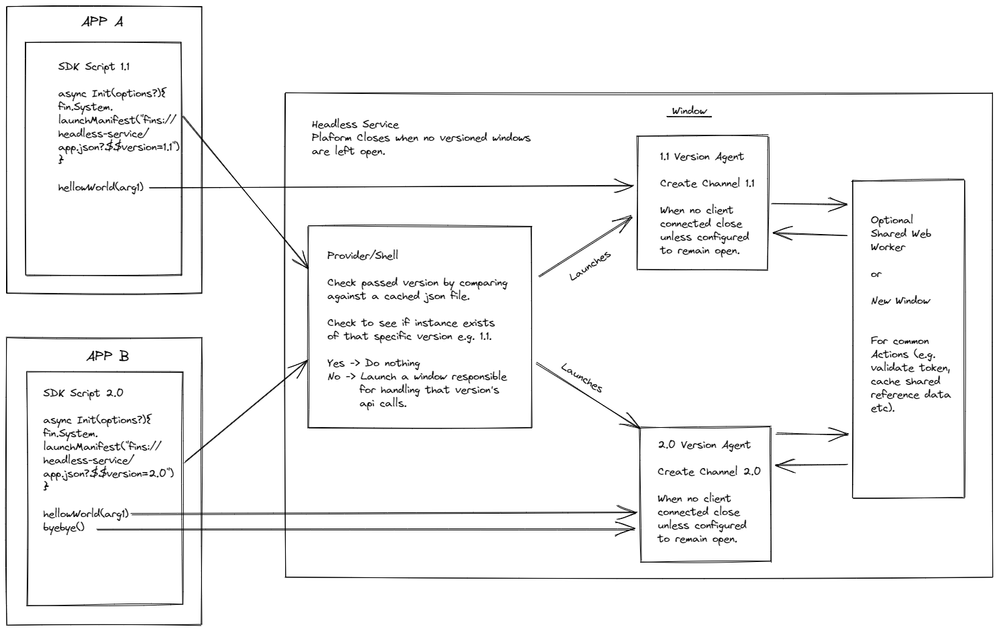

# openfin-headless-app-template

### What this example is

* An example that can be spun up by copying the folders to the root of your local dev server (if it runs on port 5000) or by typing npm start in the root directory.
* An example of building a client sdk (in a real sdk you would likely not have versioned folders and would have release branches. This versioned setup is purely to demonstrate different client applications using different versions).
* An example of building a headless service that exposes functionality to 1 or more applications/views:
    - has a config file that defines a platform application with no default visible view and defines a custom provider
    - has support for a number of versions of your sdk (in case different applications are using different versions on the same desktop)
    - can be started by the client sdk and load a version specific page to connect to
    - supports a server based config file to determine if an sdk version is supported, where you can find out more information about an sdk version and whether or not the specific sdk page should keep alive even if there are no connected clients (if you wish to cache data for example).
    - the ability to close down if there are no connected clients (if all sdk versions have keep alive set to false)
    - an example of turning off chromium's background throttling for your hidden windows
    - an example of specifying a custom process affinity for each version of your sdk (so that one does not impact the other)
* TypeScript support for the client sdk and headless service (you will need typescript installed and you can run "npm run tsc" in the root of client-sdk and test-service after running npm install for the typings file).
* An example of a simple test harness using vanilla js that has two applications for different versions of your SDK.
* A page that can be viewed in your browser to launch the test harness: <a href="http://localhost:5000" target="_blank">http://localhost:5000</a>.
* A project that has the bare minimal when it comes to dependencies.

### What this example is not

* An example of TypeScript best practice. 
* An example of a mono repo using npm 7 workspaces, pnpn, rushjs or yarn. 
* An example of best practice for sharing code across projects.
* An example of what framework or bundling tool to use (this depends on your team, project and preference).

### What is the goal of this project

To give you an idea and sample of how you could build a headless service, create a library to communicate with the service (rather than directly using OpenFin's Channel API) and consume that library from one or more OpenFin applications. 

This should let you build, debug and then build your own (after using this for ideas).

### What does this roughly look like?

More information about OpenFin:

- https://openfin.co/ -> main site
- https://developers.openfin.co/docs/getting-started => getting started guide
- https://github.com/openfin -> OpenFin Github repo

You can launch the test apps for debugging by visiting this link:

<a href="http://localhost:5000" target="_blank">http://localhost:5000</a>.

This is not a production app but is more an example, please treat it as such.
